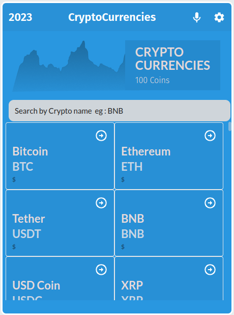

<a name="readme-top"></a>

  <h3><b>Metrics</b></h3>

</div>

<!-- TABLE OF CONTENTS -->

# 📗 Table of Contents

- [📖 About the Project](#about-project)
  - [🛠 Built With](#built-with)
    - [Tech Stack](#tech-stack)
    - [Key Features](#key-features)
  - [🚀 Live Demo](#live-demo)
- [💻 Getting Started](#getting-started)
  - [Setup](#setup)
  - [Prerequisites](#prerequisites)
  - [Install](#install)
  - [Usage](#usage)
  - [Run tests](#run-tests)
  - [Deployment](#triangular_flag_on_post-deployment)
- [👥 Authors](#authors)
- [🔭 Future Features](#future-features)
- [🤝 Contributing](#contributing)
- [⭐️ Show your support](#support)
- [🙏 Acknowledgements](#acknowledgements)
- [❓ FAQ](#faq)
- [📝 License](#license)

<!-- PROJECT DESCRIPTION -->

# 📖 Metrics<a name="about-project"></a>

**[Metrics]** This is a metrics website application for digital currency. Users can get information about a related crypto coin

# Screenshots




## 🛠 Built With <a name="built-with"></a>

- 
- 
- 
- 

- 
### Tech Stack <a name="tech-stack"></a>

<details>
  <summary>Client</summary>
  <ul>
    <li><a href="https://reactjs.org/">React.js</a></li>
  </ul>
</details>

<details>
  <summary>Server</summary>
  <ul>
    <li><a href="">Not Available</a></li>
  </ul>
</details>

<details>
<summary>Database</summary>
  <ul>
    <li><a href="">No Database</a></li>
  </ul>
</details>

<!-- Features -->

### Key Features <a name="key-features"></a>

- **[ReactJs]**
- **[Linter files]**
- **[Componets]**

<p align="right">(<a href="#readme-top">back to top</a>)</p>

<!-- LIVE DEMO -->

## 🚀 Live Demo <a name="live-demo"></a>

> Not Available

<!-- - [Live Demo Link](https://yourdeployedapplicationlink.com) -->

<p align="right">(<a href="#readme-top">back to top</a>)</p>

<!-- GETTING STARTED -->

## 💻 Getting Started <a name="getting-started"></a>

> Describe how a new developer could make use of your project.

To get a local copy up and running, follow these steps.

### Prerequisites

In order to run this project you need to:


```sh
Install nodejs
```

### Setup

Clone this repository to your desired folder:

```sh
  cd my-folder
  git clone https://github.com/tonnymuchui/metrics/
```


### Install

Install this project with:

```sh
  cd metrics
  npm install
```
-

### Usage

To run the project, execute the following command:


```sh
cd metrics
  npm run start
```
-

### Run tests

To run tests, run the following command: -->


Example command:

```sh
  npm test
```


### Deployment

You can deploy this project using:

```sh
gh-pages

```


<p align="right">(<a href="#readme-top">back to top</a>)</p>

<!-- AUTHORS -->

## 👥 Authors <a name="authors"></a>

> Mention all of the collaborators of this project.

👤 **Author1**

- GitHub: [@tonnymuchui](https://github.com/tonnymuchui)
- Twitter: [@Tonnymuchui6](https://twitter.com/Tonnymuchui6)
- LinkedIn: [Tonny Muchui](https://www.linkedin.com/in/tonny-muchui-murungi-9b549a174/)

<p align="right">(<a href="#readme-top">back to top</a>)</p>

<!-- FUTURE FEATURES -->

## 🔭 Future Features <a name="future-features"></a>

> Describe 1 - 3 features you will add to the project.

- [ ] **[Add Componets]**
- [ ] **[Refactored with hooks]**
- [ ] **[Redux]**

<p align="right">(<a href="#readme-top">back to top</a>)</p>

<!-- CONTRIBUTING -->

## 🤝 Contributing <a name="contributing"></a>

Contributions, issues, and feature requests are welcome!

Feel free to check the [issues page](../../issues/).

<p align="right">(<a href="#readme-top">back to top</a>)</p>


<!-- ACKNOWLEDGEMENTS -->

## 🙏 Acknowledgments <a name="acknowledgements"></a>

> Give credit to everyone who inspired your codebase.

I would like to thank Microverse for their contributions.

<!-- <p align="right">(<a href="#readme-top">back to top</a>)</p> -->

<!-- FAQ (optional) -->

<!-- ## ❓ FAQ <a name="faq"></a>

> Add at least 2 questions new developers would ask when they decide to use your project.

- **[Question_1]**

  - [Answer_1]

- **[Question_2]**

  - [Answer_2]

<p align="right">(<a href="#readme-top">back to top</a>)</p> -->

<!-- LICENSE -->

## 📝 License <a name="license"></a>

This project is [MIT](./LICENSE) licensed.


<p align="right">(<a href="#readme-top">back to top</a>)</p>